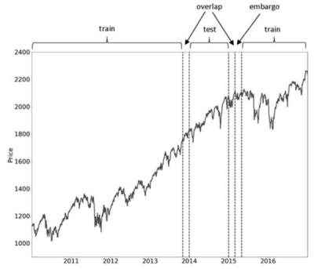
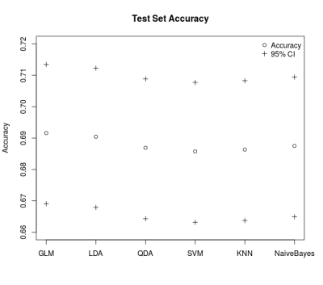
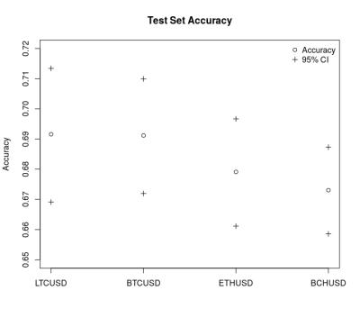
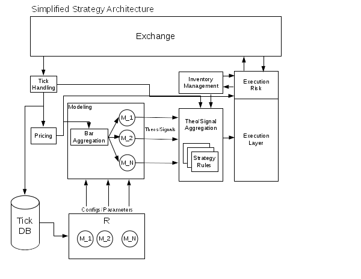

## Framework

Key components of the research and strategy development process.

- Constraints and Objectives
- Testable Hypothesis
- Model Building and Evaluation
- Backtesting

See @Peterson2015 for complete discussion of strategy development. 

## Constraints

- Capital Requirements: 
    * How much capital to I need to execute the strategy?
- Market Access: 
    * What accounts, exchanges, and banking/clearing relationships do I need?
    * What instruments can I trade? Can I short?
- Infrastructure: 
    * Server(s), trading platform, feed handler, order routing, risk checks.
- Fees:
    * What does it cost me to trade?

## Objectives

- Make money trading cryptocurrencies
- Define the type of risk and return profiles you are targeting
    * Risk adjusted return measures
    * Drawdown and other tail risk measures
    * Market observable measures
        * $/contract, % daily volume, $/day

## Hypothesis

- Define a **testable** hypothesis that makes a prediction about market
  behavior with a defined outcome and conditions to reject the hypothesis.
- Bad: Hypothesize that trades contain information.
- Better: Hypothesize that the direction of the aggressor trade is predictive
  of the next price change.
- Better: Hypothesize that the net trade flow over a specified period is
  predictive of the price change direction over the next period.

Reject the hypothesis if the predictive accuracy is no better than random. If
the hypothesis is rejected, then start over. **DO NOT** just change your 
hypothesis.

## Data Setup

- GDAX LTCUSD tick data from April 11, 2018 to April 26, 2018

- Bar Aggregation
    * Arbitrary time bars (e.g. 1 sec, 5 min, 10, min, 1 hour)
    * Tick bars
    * Event time, see @genccay2001introduction.
    * Volume and dollar bars, see @easley2012volume and @lopez2018financial.
    * Information driven bars, see @lopez2018financial.

- In Sample vs. Out of Sample (i.e. training vs testing)

```{r, echo=FALSE, include=FALSE}
library(caret)
source("data_prep.R")
# Define the train and test subset
train.subset <- "/2018-04-20"
test.subset <- "2018-04-22/"
# Get and assign the data
sym <- "LTCUSD"
x.md <- md[[sym]]
x <- volume.bars[[sym]]
```


## Data Visualization: L1 Tick Data

```{r, echo=FALSE}
# Plot the L1 tick data
p <- plot(x.md$WMP, major.ticks = "weeks", main = "LTCUSD VWAP")
p <- addSeries(x.md$BAS, on = NA, type = "h", main = "Bid-Ask Spread")
p <- addSeries(x.md$Volume, on = NA, type = "h", main = "Volume")
print(p)
```

## Data Visualization: Subset

```{r, echo=FALSE}
# Plot the L1 tick and volume bar data for a short time period
ss <- "2018-04-12 07:59:00/2018-04-12 08:05:59"
xs <- x.md[ss]
xs$Trade.On <- ifelse(xs$Price <= xs$Bid.Price, -1, 
                      ifelse(xs$Price >= xs$Ask.Price, 1, 0))
p <- plot(xs$WMP, grid.ticks.on = "hours", main = "LTC USD Trade Price")
p <- addSeries(xs$Volume, on = NA, type = "h", main = "Volume")
# Add volume bar series
p <- points(x[ss, "VWAP"], pch = 23, bg = "black", on = 1)
p <- addSeries(x[ss, "Trade.Imbalance"], on = NA, type = "h", 
               main = "Trade Imbalance")
print(p)
```

## Data Visualization: Subset

```{r, echo=FALSE}
p <- points(xs[xs$Trade.On > 0, "Price"], on = 1, bg = "green", pch = 24)
p <- points(xs[xs$Trade.On < 0, "Price"], on = 1, bg = "red", pch = 25)
print(p)
```

## Data Visualization: Volume Bar Data


```{r, echo=FALSE}
# Plot the volume bar data
p <- plot(x$VWAP, major.ticks = "weeks", observation.based = TRUE, main = "LTCUSD VWAP")
p <- addSeries(x$Volume, on = NA, type = "h", main = "Volume")
p <- addSeries(x$Trade.Imbalance, on = NA, type = "h", main = "Trade Imbalance")
p <- addEventLines(xts(matrix(c("Train End", "Test Start"), ncol = 1),
                       c(index(xts::last(x[train.subset])), 
                         index(xts::first(x[test.subset])))),
                   on = 1, srt = 90, pos = 2)
print(p)
```


## Model Setup and Hypothesis Test {.tiny}

```{r, echo=FALSE}
# Add labels... keep it simple
x$Next.Change <- lag(diff(x$VWAP), k = -1)
x$Next.Change.Sign <- ifelse(x$Next.Change > 1e-8, 1, 0)
x <- x[-nrow(x),]

# Subset the train and test data
x.train <- x[train.subset]
x.test <- x[test.subset]
```

```{r, tidy=FALSE}
# Fit a simple model using logistic regression
# glm treats the second factor as the event of interest
data.train <- as.data.frame(na.omit(x.train[,c("Trade.Imbalance", 
                                               "Next.Change.Sign")]))
data.train$Next.Change.Sign <- factor(data.train$Next.Change.Sign, 
                                      levels = c("0", "1"))
m1 <- glm(Next.Change.Sign ~ Trade.Imbalance, 
          data = data.train, family = binomial(link = "logit"))
```

***
```{r}
summary(m1)
```

## In Sample Confusion Matrix {.tiny}

```{r, echo=FALSE}
# In sample predictions
train.probs <- predict(m1, type = "response")
train.pred <- ifelse(train.probs >= 0.5, "1", "0")
confusionMatrix(factor(train.pred, levels = c("0", "1")),
                       data.train$Next.Change.Sign, positive = "1")
```


## Out of Sample Confusion Matrix {.tiny}

```{r, echo=FALSE}
data.test <- as.data.frame(na.omit(x.test[,c("Trade.Imbalance", "Next.Change.Sign")]))
data.test$Next.Change.Sign <- factor(data.test$Next.Change.Sign, levels = c("0", "1"))
# predict on out of sample data
test.probs <- predict(m1, newdata = data.test, type = "response")
test.pred <- ifelse(test.probs >= 0.5, "1", "0")
confusionMatrix(factor(test.pred, levels = c("0", "1")),
                data.test$Next.Change.Sign, positive = "1")
```

## Standard K-Fold Cross Validation


WARN: use for time series at your own peril!

## Time Series Cross Validation

Time series cross validation (i.e. walk forward), see @hyndman2018forecasting.


## Purged K-Fold Cross Validation

Purged k-fold cross validation with embargo periods, see @lopez2018financial.



## Cross Validation for Higher Frequency Time Series {.tiny}

Apply time series cross validation/walk forward analysis at a specified
frequency

```{r}
ep.d <- endpoints(x.train, on = "days")
index.cv <- list()
index.cv$index.in <- index.cv$index.out <- list()
j <- 1
for(i in 6:length(ep.d)-1){
  index.cv$index.in[[j]] <- 1:ep.d[i]
  index.cv$index.out[[j]] <- (ep.d[i] + 1):ep.d[i+1]
  j <- j + 1
}
```

***

```{r, echo=FALSE}
  idx.in <- index.cv$index.in[[1]]
  idx.out <- index.cv$index.out[[1]]
  p <- plot(x.train$VWAP, main = paste("TSCV", 1), major.ticks = "weeks", 
            col = "gray", lwd = 1)
  p <- lines(x.train[idx.in]$VWAP, col = "blue", lwd = 2)
  p <- lines(x.train[idx.out]$VWAP, col = "red", lwd = 2)
  p <- addLegend(legend.loc = "topleft", legend.names = c("Train", "Test"), 
                 col = c("blue", "red"), lty = c(1,1))
  print(p)
```


## Cross Validation for Higher Frequency Time Series

```{r}
# Use caret::trainControl with our index.cv object
tc <- trainControl(method = "timeslice", index = index.cv$index.in, 
                   indexOut = index.cv$index.out)
mc <- train(Next.Change.Sign ~ Trade.Imbalance, data = data.train,
            method = "glm", family = binomial(link = "logit"),
            trControl = tc)
mc
```


## Model Evaluation

Fit the following model. Consider multiple classification algorithms, both 
linear and non-linear

```
Next.Change.Sign ~ Trade.Imbalance + Trade.Imbalance.Diff
```

```{r, echo=FALSE}

```

\* model tuning done using time series cross validation index defined earlier


## Model Robustness

Does the model work on other cryptocurrencies, asset classes, and/or frequencies?

Two factor logistic regression model on more coins. Training set of 2018-04-11
through 2018-04-20 and test set of 2018-04-22 through 2018-04-26.

```{r, echo=FALSE}

```

## Strategy Framework with Models

```{r, echo=FALSE}

```

<!--
- Modular architecture to turn on/off
- Automate the fit and update process
- Track model performance in real time
-->

## Future Work

- Custom loss function.
- More data.
- Evaluate more models, e.g. classification trees and rule-based models, as well
  as boosting and bagging techniques.
- More features, e.g. regime changes, structural breaks, and microstructure.
  Feature importance analysis.

## Conclusion

- Think about your features.
- Do not blindly apply standard predictive modeling/machine learning techniques
  such as cross validation and bootstrapping.
- Be cognizant of the dangers of overfitting, data leakage, and biases. 
- Follow a framework or process that is designed to avoid these common mistakes.

Presentation source, analysis scripts, and data:

https://github.com/rossb34/PredictiveModeling_20180530

https://rossb34.github.io/PredictiveModeling_20180530

## Disclaimer

Disclaimer: Past results do not guarantee future returns. The data and models
shared in this presentation are for informational purposes only and does not
offer advice to buy or sell any securities, derivatives, or financial products.


## References

